# Activity Diagrams - Web Gym Management System

Dokumen ini berisi kode **PlantUML** untuk Activity Diagram dari setiap Use Case pada Sistem Informasi Manajemen Web Gym. Silakan salin masing-masing blok kode ke editor PlantUML atau Visual Paradigm Anda.

---

## 1. Activity Diagram: Register
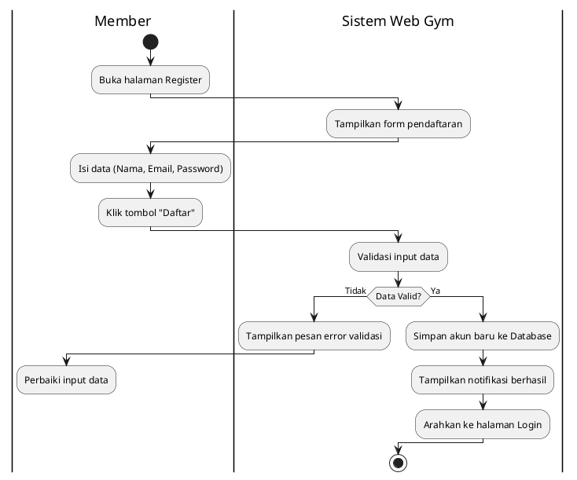

## 2. Activity Diagram: Login
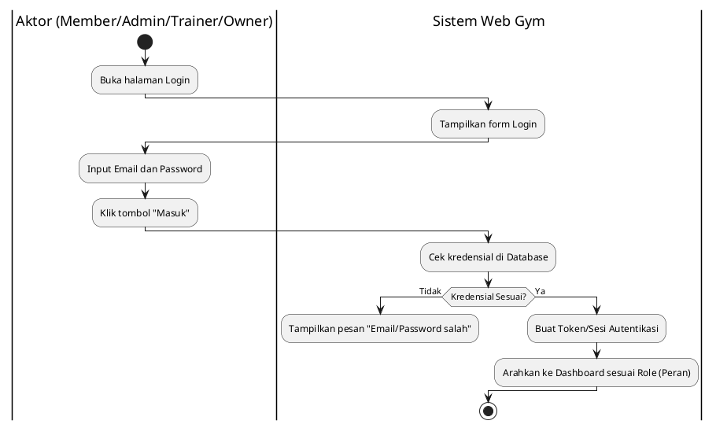

## 3. Activity Diagram: Lihat Katalog Fasilitas & Paket
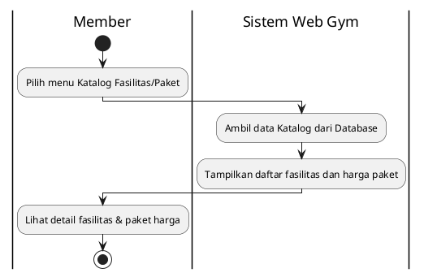

## 4. Activity Diagram: Beli Paket Langganan
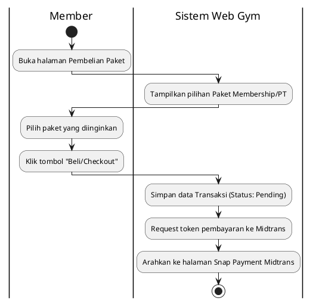

## 5. Activity Diagram: Pemrosesan Pembayaran (Midtrans)
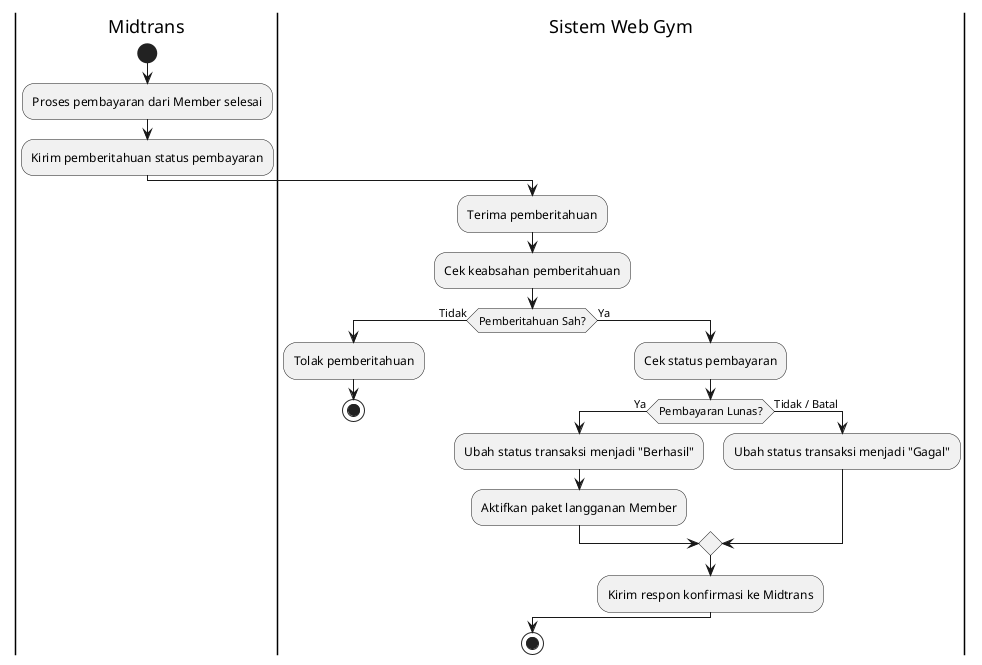

## 6. Activity Diagram: Booking Jadwal PT
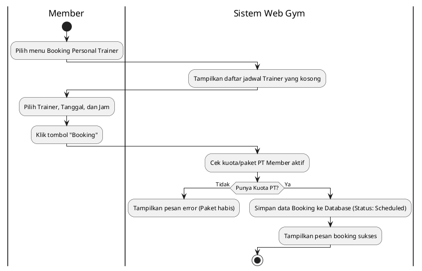

## 7. Activity Diagram: Pencatatan BMI Log
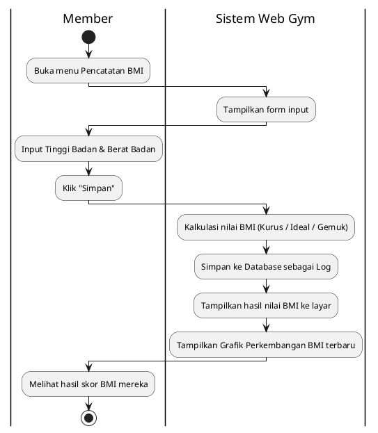

## 8. Activity Diagram: Interaksi Live Chat
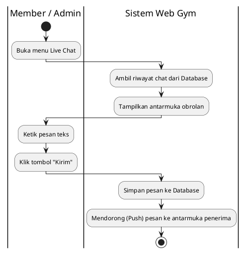

## 9. Activity Diagram: Lihat Laporan Statistik Dashboard
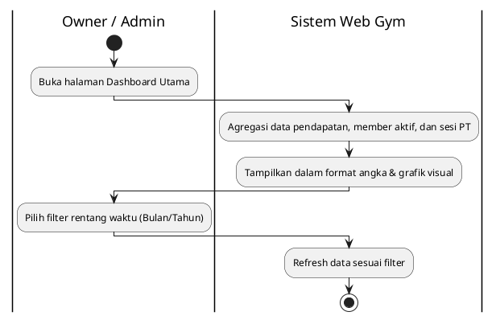

## 10. Activity Diagram: Kelola Master Data
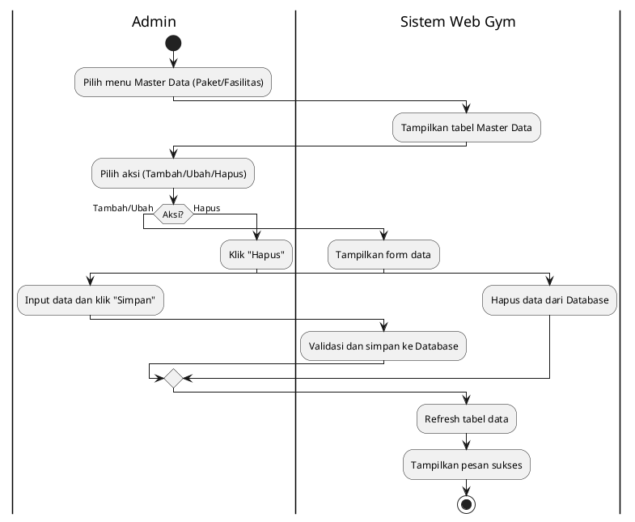

## 11. Activity Diagram: Kelola Transaksi & Member
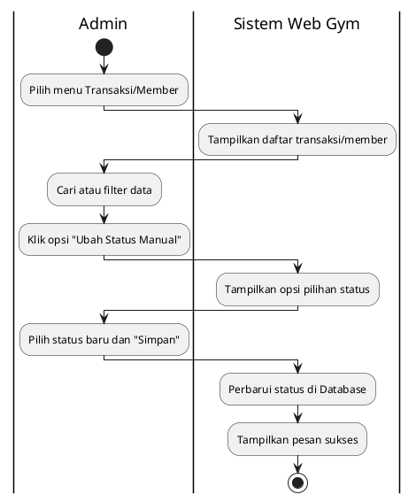

## 12. Activity Diagram: Catat Pengunjung Walk-In
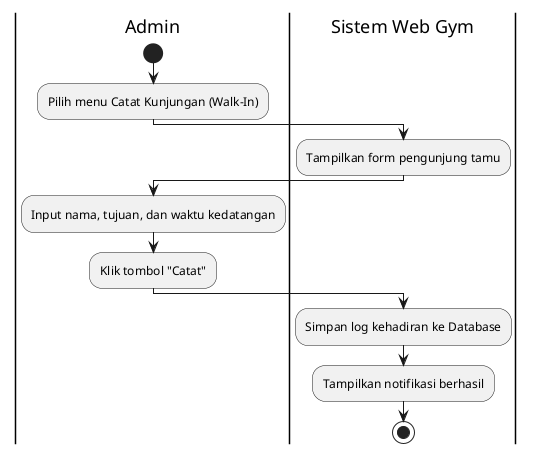

## 13. Activity Diagram: Update Status Sesi Latihan
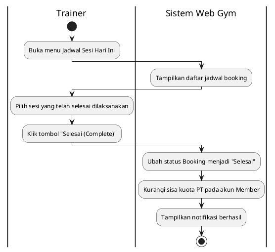
