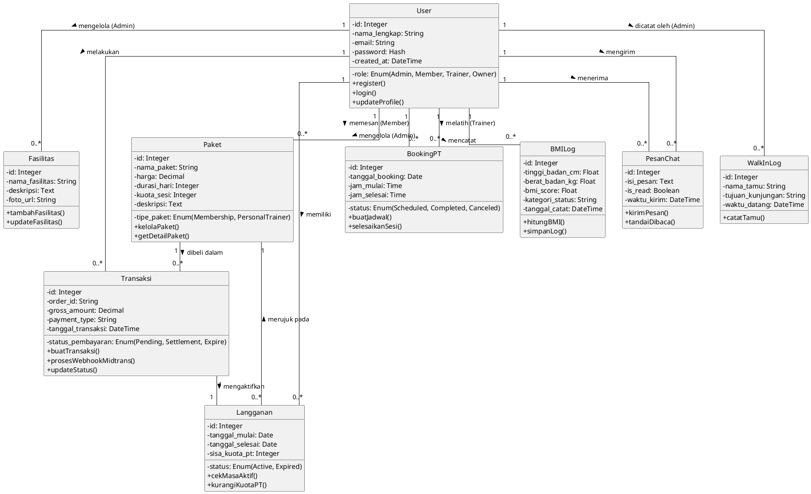

# Class Diagram - Web Gym Management System

Dokumen ini berisi kode **PlantUML** untuk **Class Diagram**. Diagram ini memetakan seluruh entitas (Tabel/Model Database) yang ada pada sistem Web Gym, lengkap beserta atribut (kolom), operasi (method), dan garis relasi yang menghubungkan satu kelas dengan kelas lainnya secara konseptual.

Silakan *copy-paste* kode di bawah ini ke Visual Paradigm atau editor PlantUML Anda:

