# Sequence Diagrams - Web Gym Management System (BCE Pattern)

Dokumen ini berisi kode **PlantUML** untuk Sequence Diagram yang telah disesuaikan dengan pola **Boundary-Control-Entity (BCE)**.
Teks isinya 100% mengikuti langkah-langkah yang ada di **Activity Diagram** yang kita buat sebelumnya.
(Catatan: Perintah `hide footbox` ditambahkan agar logo/aktor di bagian bawah diagram disembunyikan sesuai permintaan).

---

## 1. Sequence Diagram: Register
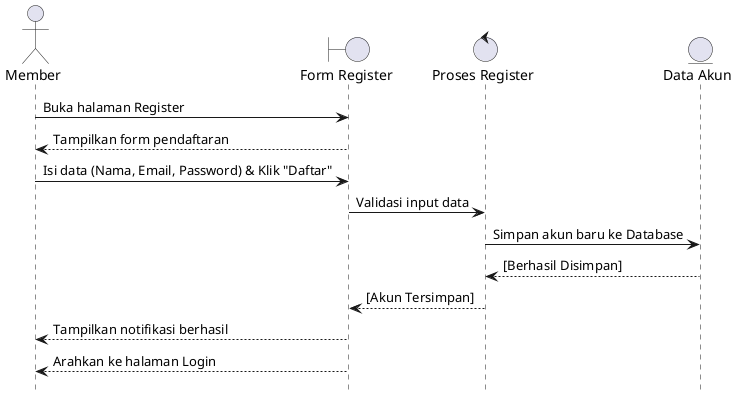

## 2. Sequence Diagram: Login
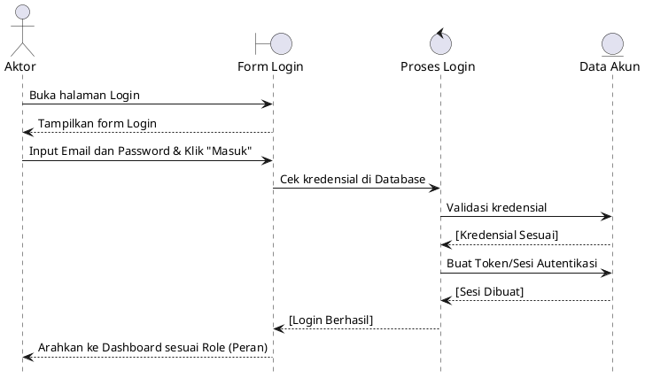

## 3. Sequence Diagram: Lihat Katalog Fasilitas & Paket
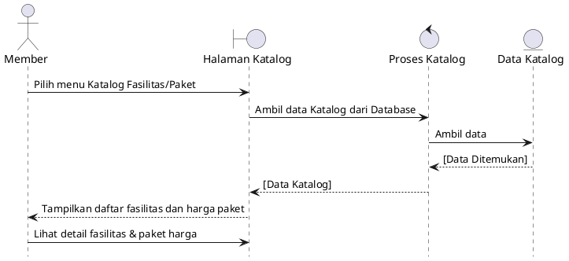

## 4. Sequence Diagram: Beli Paket Langganan
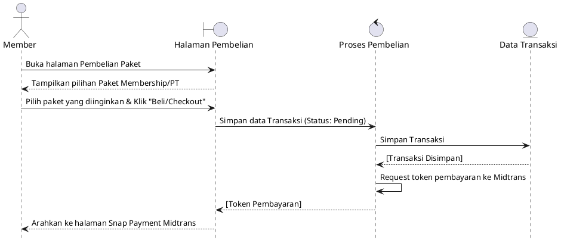

## 5. Sequence Diagram: Pemrosesan Pembayaran (Midtrans)
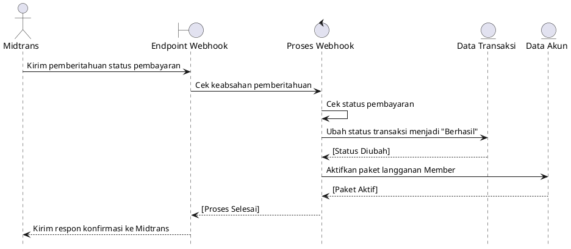

## 6. Sequence Diagram: Booking Jadwal PT
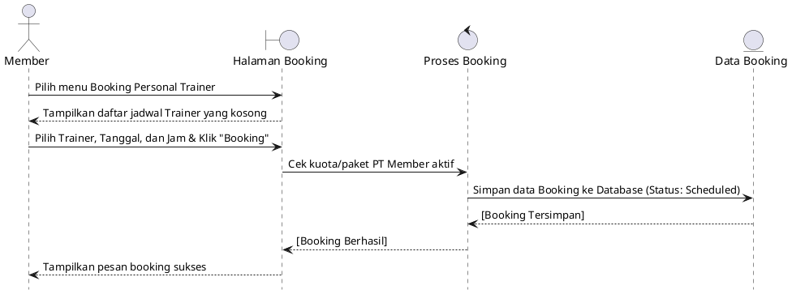

## 7. Sequence Diagram: Pencatatan BMI Log
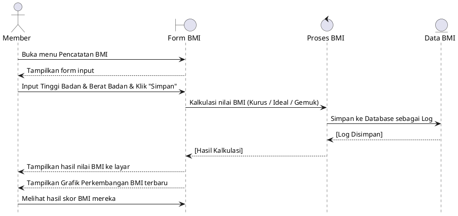

## 8. Sequence Diagram: Interaksi Live Chat
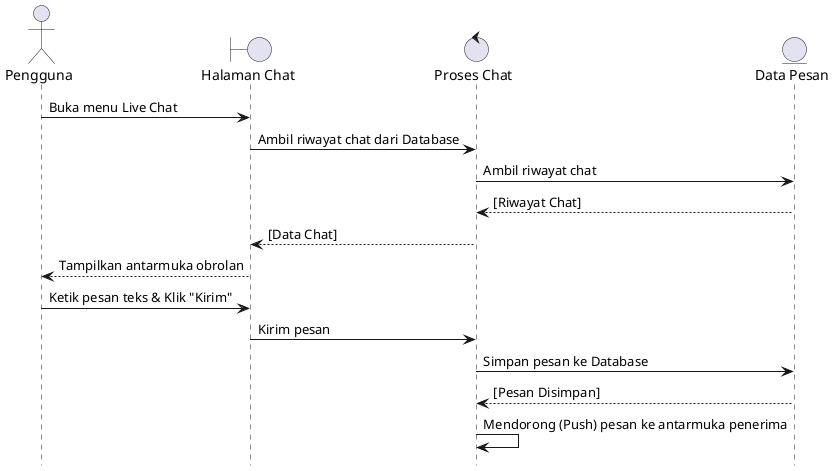

## 9. Sequence Diagram: Lihat Laporan Statistik Dashboard
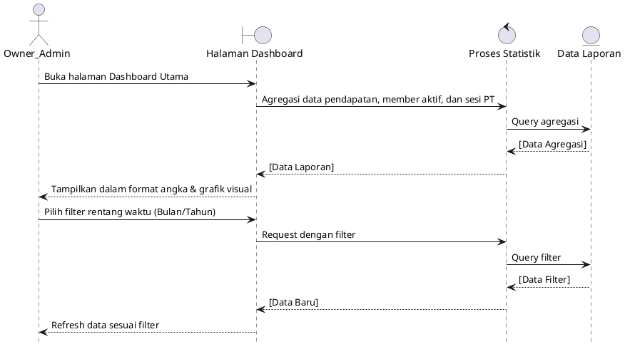

## 10. Sequence Diagram: Kelola Master Data
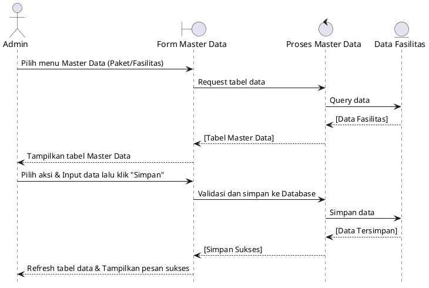

## 11. Sequence Diagram: Kelola Transaksi & Member
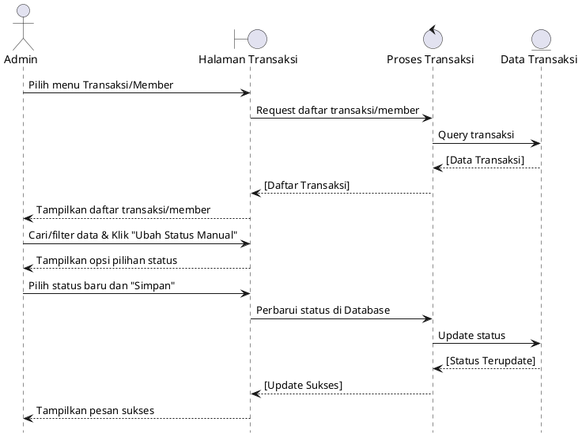

## 12. Sequence Diagram: Catat Pengunjung Walk-In
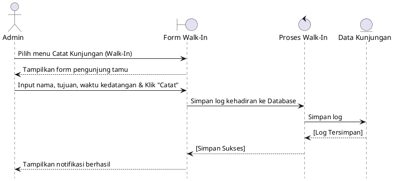

## 13. Sequence Diagram: Update Status Sesi Latihan
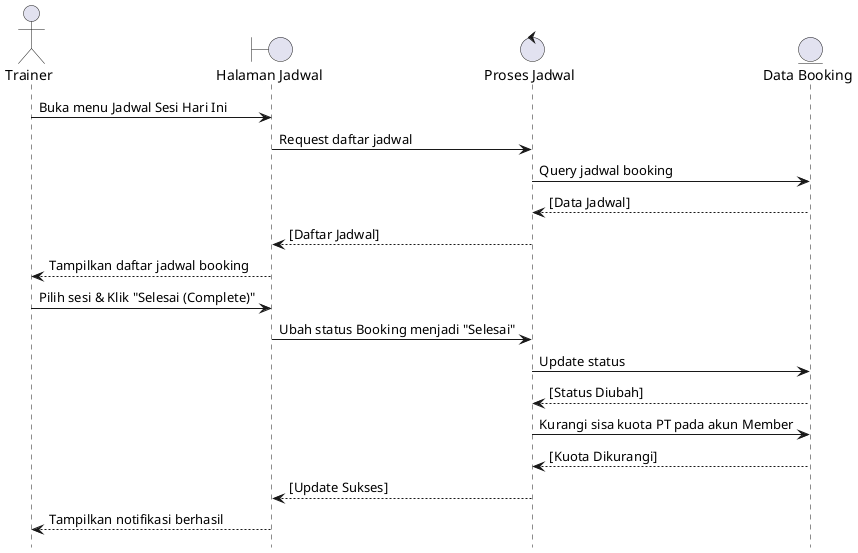
